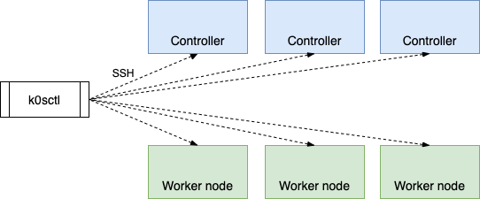
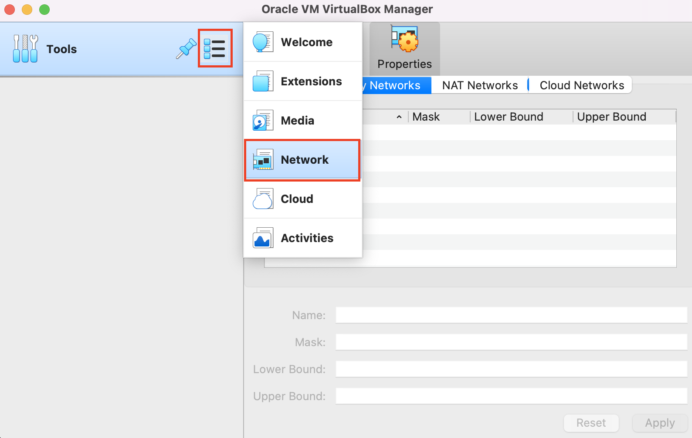
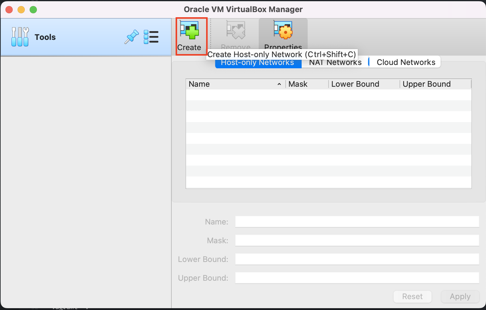
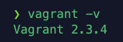

# Belajar "k0s" Distribution #
**k0s** adalah open source, distribusi Kubernetes all-inclusive, yang dikonfigurasi dengan semua fitur yang diperlukan untuk membangun kluster Kubernetes. Karena desainnya yang sederhana, opsi penerapan yang fleksibel, dan persyaratan sistem yang sederhana, **k0s** sangat cocok untuk:

- Semua cloud provider
- Bare Metal
- Edge dan IoT

**k0s** secara drastis mengurangi kerumitan menginstal dan menjalankan distribusi Kubernetes bersertifikasi CNCF. Dengan **k0s** cluster baru dapat di-bootstrap dalam hitungan menit dan friksi pengembang dikurangi menjadi nol. Hal ini memungkinkan siapa saja yang tidak memiliki keahlian atau keahlian khusus di Kubernetes untuk memulai dengan mudah.

**k0s** didistribusikan sebagai biner tunggal (*single app*) dengan tidak ada ketergantungan dari *Host* OS selain *kernel* OS. **k0s** bekerja dengan Linux apa pun tanpa paket atau konfigurasi perangkat lunak tambahan. Kerentanan keamanan atau masalah kinerja apa pun dapat diperbaiki secara langsung dalam distribusi **k0s** yang membuatnya sangat mudah untuk menjaga agar cluster tetap mutakhir dan aman.

> Dikutip dan ditranslasi dari: https://docs.k0sproject.io/v1.23.6+k0s.2/

## k0sctl ##
**k0sctl** adalah alat bantu/*tool* baris perintah untuk bootstrap dan mengelola kluster **k0s**. **k0sctl** terhubung ke host yang disediakan menggunakan SSH dan mengumpulkan informasi tentang host, yang membentuk cluster dengan mengkonfigurasi host, menyebarkan **k0s**, dan kemudian menghubungkan node **k0s** bersama-sama.



## Getting Started ##
- [Sistem Rekomendasi](#sistem-rekomendasi)
- [Konfigurasi Virtual Box](#konfigurasi-virtual-box)
- [Instalasi Vagrant](#instalasi-vagrant)
- [Konfigurasi Server Menggunakan Vagrant](#)
- [Instalasi k0sctl](#instalasi-k0sctl)
- [Konfigurasi Kubernetes Cluster](#konfigurasi-kubernetes-cluster)
- [Apply Konfigurasi k0sctl](#apply-konfigurasi-k0sctl)
- [Test Deployment](#test-deployment)
- [Clean Up](#)

## Sistem Rekomendasi ##
- Total VM: `3 VM` atau lebih dengan memperhatikan *quorum* (n + 2) / ganjil.
- CPU/vCPU per VM: `1 Core` (Rekomendasi: `2 Core`)
- Memory/RAM per VM: `1024 MB` (Rekomendasi: `2 GB` atau lebih)
- Storage per VM: `20 GB` (Rekomendasi: `50 GB` atau lebih)
- Kebutuhan software lainnya:
  - Pastikan kamu telah mempunyai **Virtualization Software** seperti [Virtual Box](https://www.virtualbox.org/), [VMWare](https://www.vmware.com/) atau lainnya. (Disarankan menggunakan **Virtual Box** karena seluruh tutorial ini akan menggunakan *Virtual Box*)
  - Pastikan kamu telah mempunyai/memasang **kubectl** pada PC/Laptop kamu (Untuk penjelasan instalasi, dapat di cek [disini](https://kubernetes.io/docs/tasks/tools/))
- Clone repositori ini

## Konfigurasi Virtual Box ##
Sebelum melanjutkan tutorial, kita harus melakukan konfigurasi **Virtual Box** terlebih dahulu. Adapun konfigurasi yang harus kita tambahkan adalah menambah network **Host Only** karena kita akan menggunakan IP local dari virtual box:
- Buka Virtual Box
- Pilih ***Tools** -> **Network**

- Pada tab **Host-only Networks**, klik tombol **Create**

- Lalu, secara otomatis akan ter-*create* host network dengan range IP `192.168.56.1` - `192.168.56.199` (Dengan asumsi net mask: `192.168.56.0/24`)

## Instalasi Vagrant ##
- Cek sesuai dengan OS masing-masing
- Download dan lakukan langkah instalasi *Vagrant* seperti yang tertera [disini](https://developer.hashicorp.com/vagrant/downloads?product_intent=vagrant)
- Pasang perintah **Vagrant** pada **PATH** environment variable-mu
- Cek bahwa *Vagrant* telah terpasang dengan baik
```
vagrant -v
```
- Maka akan muncul tampilan versi *Vagrant* seperti dibawah ini:



## Konfigurasi Server Menggunakan Vagrant ##
- Buka file `vagrant/Vagrant`
- Lakukan konfigurasi sesuai kebutuhan
- Jalankan **Vagrant**:
  - `vagrant up`: Untuk menjalankan semua VM
  - `vagrant halt`: Untuk memberhentikan semua VM
  - `vagrant destroy`: Untuk memberhentikan dan menghapus data VM

## Instalasi k0sctl ##
- Buka https://github.com/k0sproject/k0sctl/releases
- Download binary sesuai dengan OS kamu
- Lalu, pastikan `k0sctl` dapat diakses melalui terminal atau command-prompt

Atau, jika kamu menggunakan package manager, gunakan langkah berikut:
- Buka https://github.com/k0sproject/k0sctl#package-managers
- Lakukan instalasi **k0sctl** sesuai dengan package manager OS kamu

## Konfigurasi Kubernetes Cluster ##
- Sebelum melakukan konfigurasi **k0sctl**, kita perlu mengetahui **Public Key** dari setiap VM yang di-*inisiasi* oleh vagrant
- Caranya adalah sebagai berikut:
  - Pindah direktori ke `vagrant`
  - Jalankan perintah `vagrant ssh-config "control-plane"`, lalu buka dan catat lokasi **pubkey** `IdentityFile`.
  - Jalankan perintah diatas untuk 2 VM selanjutnya (`worker-1` dan `worker-2`)
- Buka file `k0s/k0sctl.yaml`
- Lakukan konfigurasi sesuai kebutuhan

## Apply Konfigurasi k0sctl ##
- Setelah semua konfigurasi selesai diubah, jalankan perintah berikut:
```
k0sctl apply -c k0s/k0sctl.yaml
```
- Lalu, tunggu hingga instalasi kubernetes selesai

## Test Deployment ##
- Selanjutnya, langkah terakhir adalah kita akan mengecek cluster dan membuat sebuah sample **POD**
- Pindah direktori ke `k0s`
- Jalankan perintah:
```
k0sctl kubeconfig > config
export KUBECONFIG=$PWD/config
```
- Lalu, cek cluster:
```
kubectl get no -o wide
```
- Selanjutnya, pindah direktori ke `k8s`
- Apply deployment dan service
```
kubectl apply -f .
```
- Cek deployment:
```
kubectl get deploy --watch
```
- Cek pod:
```
kubectl get po --watch
```
- Cek service:
```
kubectl get svc --watch
```
- Test aplikasi:
```
kubectl port-forward service/nginx 8000:80
```
- Buka pada browser kamu: http://localhost:8000

## Clean Up ##
- Apabila kamu ingin menghapus/me-*reset* cluster k0s, jalankan perintah berikut (Pindah direktori ke `k0s` terlebih dahulu):
```
cd k0s
k0sctl reset
```
- Kemudian, untuk menghapus VM, pindah direktori ke `vagrant`, lalu jalankan perintah berikut:
```
vagrant destroy
```

---

> DISCLAIMER: Seluruh tutorial ini menggunakan versi saat tutorial ini dibuat. Jika pada saat kamu mencoba menggunakan versi yang lebih terkini dan tutorial ini belum di-update, mohon sesuaikan dengan kebutuhann versi *software* tersebut.
